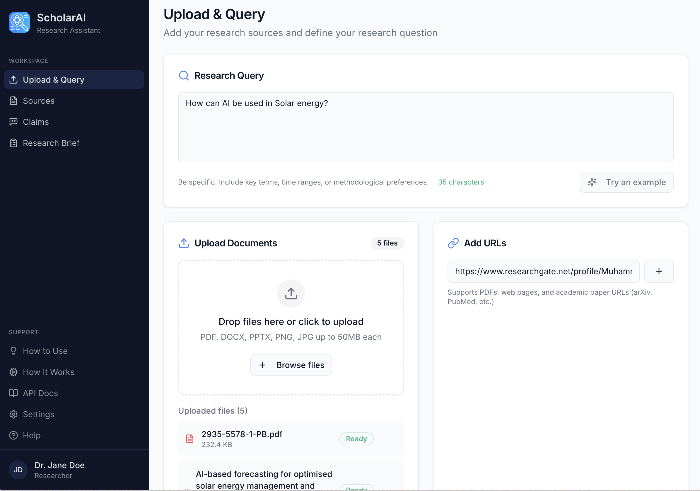
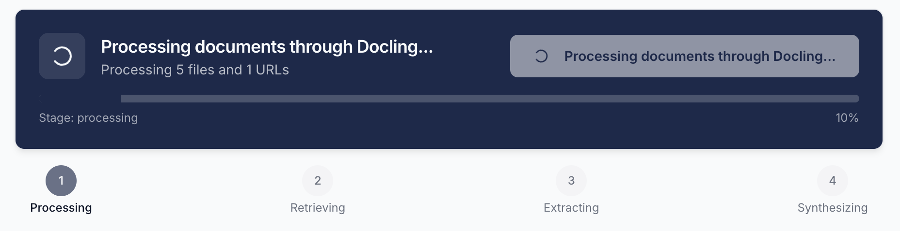
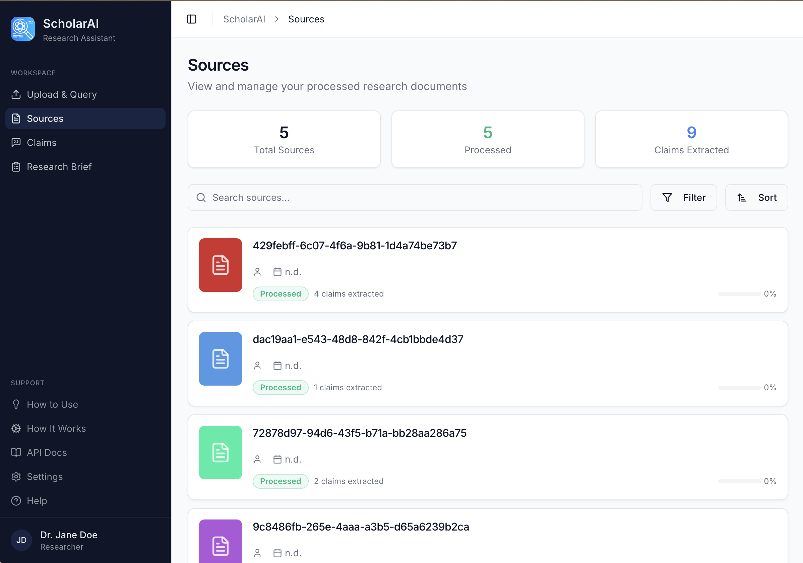
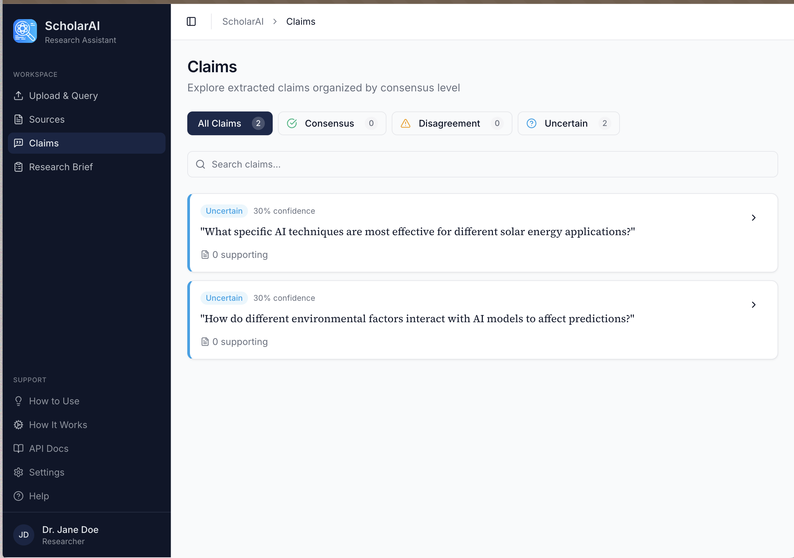
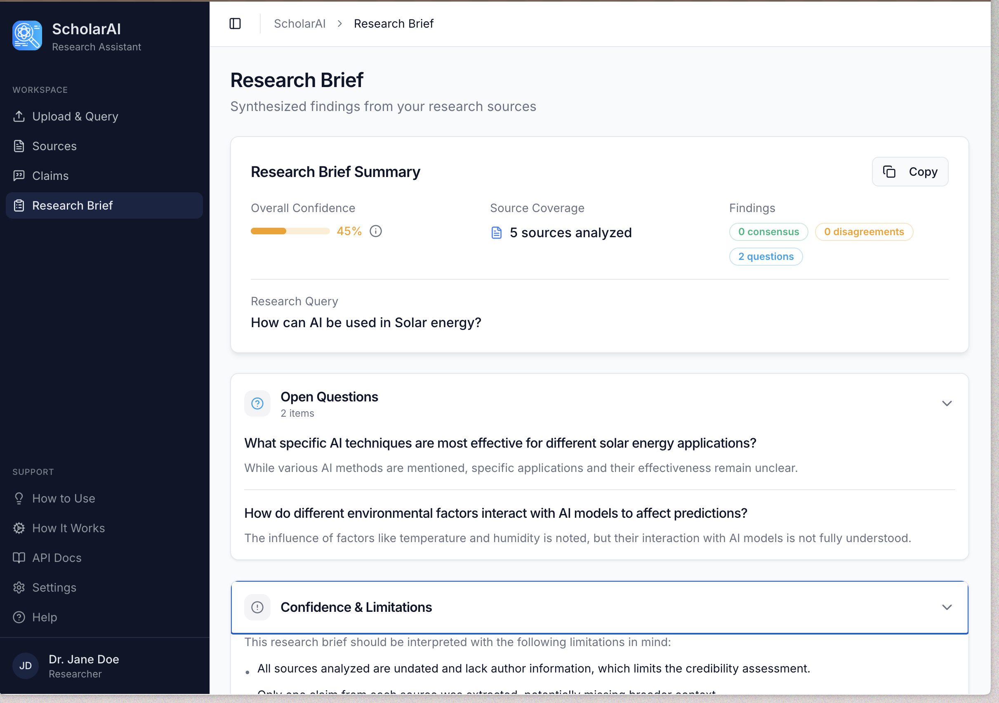
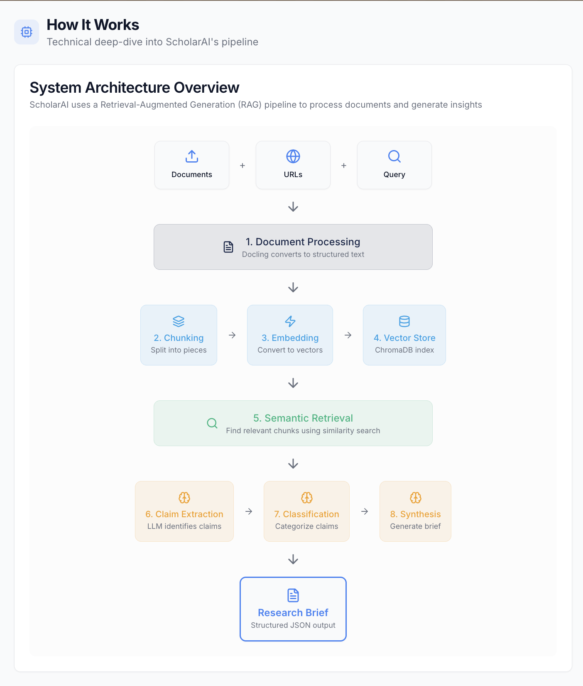
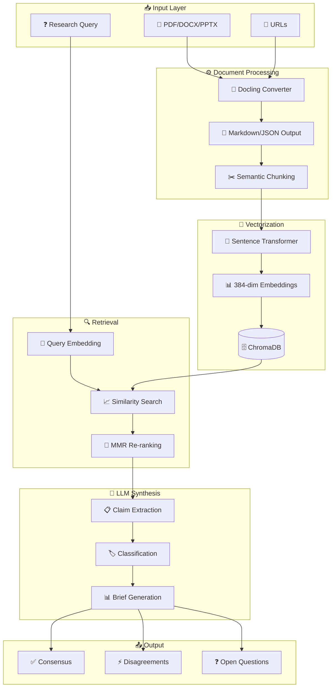
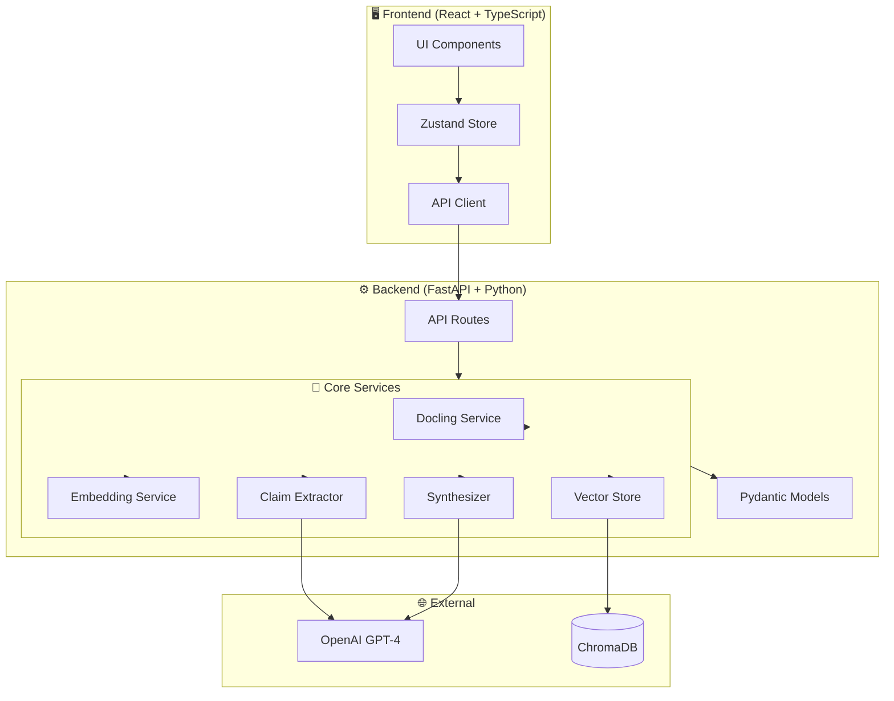

# ScholarAI - Autonomous Research Engineer

<div align="center">


**An AI-powered research synthesis platform that extracts, analyzes, and synthesizes knowledge from academic documents.**

[Features](#-features) • [Screenshots](#-screenshots) • [Quick Start](#-quick-start) • [How It Works](#-how-it-works) • [API](#-api-documentation)

</div>

---

## 🎯 What is ScholarAI?

ScholarAI is an **Autonomous Research Engineer** that helps researchers, students, and professionals synthesize knowledge from multiple documents. Unlike chatbots, ScholarAI provides structured research briefs that identify:

- **✅ Areas of Consensus** - What sources agree on
- **⚡ Areas of Disagreement** - Conflicting findings and perspectives  
- **❓ Open Questions** - Gaps in the literature that need further research

---

## 📸 Screenshots

### Upload & Query Interface
*Enter your research question and upload documents or add URLs*



### Processing Pipeline
*Watch real-time progress as documents are processed through the 4-stage pipeline*



### Sources Panel
*View all processed sources with metadata and extraction statistics*



### Claims Extraction
*Explore extracted claims categorized by consensus level*



### Research Brief
*Comprehensive synthesis with consensus, disagreements, and open questions*



### How It Works Guide
*Built-in documentation explaining the RAG pipeline and technical concepts*



---

## 🔄 How It Works

### RAG Pipeline Architecture



### Pipeline Stages Explained

```
┌─────────────────────────────────────────────────────────────────────────────┐
│                         ScholarAI Processing Pipeline                        │
├─────────────────────────────────────────────────────────────────────────────┤
│                                                                             │
│  ┌──────────┐    ┌──────────┐    ┌──────────┐    ┌──────────┐              │
│  │    1     │    │    2     │    │    3     │    │    4     │              │
│  │Processing│───▶│Retrieving│───▶│Extracting│───▶│Synthesize│              │
│  │          │    │          │    │          │    │          │              │
│  └──────────┘    └──────────┘    └──────────┘    └──────────┘              │
│       │               │               │               │                     │
│       ▼               ▼               ▼               ▼                     │
│  ┌──────────┐    ┌──────────┐    ┌──────────┐    ┌──────────┐              │
│  │ • Docling│    │ • Embed  │    │ • GPT-4  │    │ • Format │              │
│  │ • Chunk  │    │   Query  │    │ • Extract│    │ • Score  │              │
│  │ • Embed  │    │ • Vector │    │   Claims │    │ • Export │              │
│  │ • Index  │    │   Search │    │ • Classify│   │          │              │
│  └──────────┘    └──────────┘    └──────────┘    └──────────┘              │
│                                                                             │
└─────────────────────────────────────────────────────────────────────────────┘
```

### Claim Classification System

```
                    ┌─────────────────────────────────────┐
                    │        Extracted Claims             │
                    └─────────────────────────────────────┘
                                    │
                    ┌───────────────┼───────────────┐
                    ▼               ▼               ▼
            ┌─────────────┐ ┌─────────────┐ ┌─────────────┐
            │  ✅ CONSENSUS │ │⚡ DISAGREEMENT│ │ ❓ UNCERTAIN │
            ├─────────────┤ ├─────────────┤ ├─────────────┤
            │ Multiple    │ │ Sources     │ │ Insufficient│
            │ sources     │ │ conflict    │ │ evidence or │
            │ agree       │ │ on findings │ │ single      │
            │             │ │             │ │ source      │
            └─────────────┘ └─────────────┘ └─────────────┘
```

---

## ✨ Features

### Document Processing
- 📄 **Multi-format support**: PDF, DOCX, PPTX, images (PNG, JPG)
- 🔗 **URL processing**: Academic papers, web articles, arXiv links
- 🧠 **Intelligent chunking**: Semantic boundaries with configurable overlap
- 📊 **Metadata extraction**: Authors, dates, titles automatically detected

### RAG Pipeline
- 🔍 **Semantic search**: ChromaDB vector store with sentence transformers
- 🎯 **Query expansion**: Automatic synonym and concept expansion
- 📈 **Relevance scoring**: MMR-based re-ranking for diverse results

### Claim Extraction
- ✅ **Consensus detection**: Claims supported by multiple sources
- ⚡ **Disagreement identification**: Conflicting viewpoints highlighted
- ❓ **Uncertainty flagging**: Areas needing more research
- 🔗 **Source attribution**: Every claim linked to original sources

### Research Brief Synthesis
- 📋 **Structured output**: Organized sections for easy navigation
- 📊 **Confidence scoring**: Overall reliability assessment
- ⚠️ **Limitations noted**: Transparent about research gaps
- 📤 **Export ready**: Copy-to-clipboard functionality

---

## 🚀 Quick Start

### Prerequisites

- **Python 3.11+** with pip
- **Node.js 18+** with npm
- **OpenAI API Key** (for claim extraction and synthesis)

### 1. Clone the Repository

```bash
git clone https://github.com/sparsh2005/ScholarAI.git
cd ScholarAI
```

### 2. Backend Setup

```bash
# Navigate to backend
cd backend

# Create virtual environment
python -m venv venv
source venv/bin/activate  # On Windows: venv\Scripts\activate

# Install dependencies
pip install -r requirements.txt

# Create environment file
echo "OPENAI_API_KEY=your-api-key-here" > .env

# Start the backend server
uvicorn main:app --reload --port 8000
```

### 3. Frontend Setup

```bash
# From project root
cd ..  # if you're in backend/

# Install dependencies
npm install

# Start the development server
npm run dev
```

### 4. Open the Application

Visit **http://localhost:8080** in your browser.

---

## 🏗️ Architecture

### System Overview



### Project Structure

```
ScholarAI/
├── backend/                 # FastAPI Backend
│   ├── api/
│   │   └── routes/          # API endpoint handlers
│   ├── models/
│   │   └── schemas.py       # Pydantic models
│   ├── services/
│   │   ├── docling_service.py      # Document processing
│   │   ├── embedding_service.py    # Text embeddings
│   │   ├── vector_store.py         # ChromaDB operations
│   │   ├── claim_extractor.py      # LLM claim extraction
│   │   └── synthesizer.py          # Brief generation
│   ├── tests/               # Pytest test suite
│   ├── config.py            # Settings management
│   ├── main.py              # FastAPI application
│   └── requirements.txt
│
├── src/                     # React Frontend
│   ├── components/
│   │   ├── brief/           # Research brief display
│   │   ├── claims/          # Claims panel
│   │   ├── sources/         # Sources panel
│   │   ├── upload/          # Upload components
│   │   ├── layout/          # App layout
│   │   └── ui/              # shadcn/ui components
│   ├── hooks/
│   │   └── use-research.ts  # Zustand state management
│   ├── lib/
│   │   └── api.ts           # API client
│   └── pages/               # Route pages
│
├── examples/                # Sample documents & outputs
└── public/                  # Static assets
```

### Technology Stack

| Layer | Technologies |
|-------|-------------|
| **Frontend** | React 18, TypeScript, Tailwind CSS, shadcn/ui, Zustand |
| **Backend** | FastAPI, Python 3.11+, Pydantic v2 |
| **Document Processing** | Docling (IBM Research), pypdf |
| **Vector Store** | ChromaDB, sentence-transformers (all-MiniLM-L6-v2) |
| **LLM** | OpenAI GPT-4 (claim extraction, synthesis) |

---

## 🔧 API Documentation

### Base URL
```
http://localhost:8000
```

### Endpoints

| Method | Endpoint | Description |
|--------|----------|-------------|
| `GET` | `/health` | Health check |
| `POST` | `/api/process-docs/upload` | Upload a document |
| `POST` | `/api/process-docs` | Process documents & URLs |
| `POST` | `/api/retrieve-chunks` | Semantic search |
| `POST` | `/api/extract-claims` | Extract & classify claims |
| `POST` | `/api/synthesize-report` | Generate research brief |
| `GET` | `/api/storage-stats` | Get storage usage |
| `DELETE` | `/api/clear-data` | Clear all stored data |

### Interactive API Docs

Visit **http://localhost:8000/docs** for Swagger UI documentation.

---

## 🧪 Testing

```bash
# Backend tests
cd backend
pytest tests/ -v --cov=.

# Frontend tests
npm run test
```

---

## ⚙️ Configuration

### Backend Environment Variables

Create `backend/.env`:

```env
# Required
OPENAI_API_KEY=sk-...

# Optional - Defaults shown
UPLOAD_DIRECTORY=./data/uploads
PROCESSED_DIRECTORY=./data/processed
CHROMA_PERSIST_DIRECTORY=./data/chroma
CHUNK_SIZE=512
CHUNK_OVERLAP=50
EMBEDDING_MODEL=all-MiniLM-L6-v2
MAX_FILE_SIZE_MB=50
```

---

## 🤝 Contributing

Contributions are welcome! Please:

1. Fork the repository
2. Create a feature branch (`git checkout -b feature/amazing-feature`)
3. Commit changes (`git commit -m 'Add amazing feature'`)
4. Push to branch (`git push origin feature/amazing-feature`)
5. Open a Pull Request

---

## 📄 License

This project is licensed under the MIT License - see the [LICENSE](LICENSE) file for details.

## 🙏 Acknowledgments

- [Docling](https://github.com/DS4SD/docling) - Document processing by IBM Research
- [ChromaDB](https://www.trychroma.com/) - Vector database
- [shadcn/ui](https://ui.shadcn.com/) - UI components
- [FastAPI](https://fastapi.tiangolo.com/) - Backend framework

---

<div align="center">

**Built with ❤️ for researchers everywhere**

[⬆ Back to Top](#scholarai---autonomous-research-engineer)

</div>
